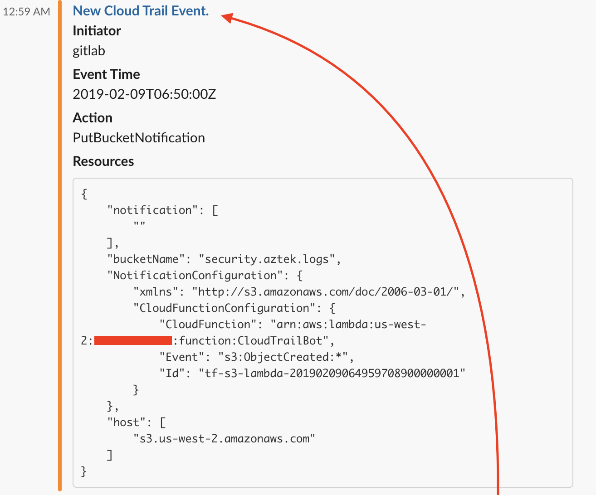

# CloudTrail Bot

## Why use this?

Have you ever had a co-worker that insisted on manual configurations to infrastructure and made changes outside of IaC?

That's why I wrote this lambda function.

## How does it work?

A cloudtrail is is created loging json.gz files to a s3 bucket.  A lambda is triggered on new s3 object creation, and relevent events are pushed to Slack.

## How do I install it in my Environment?

Checkout .gitlab-ci.yml for current build steps.  Don't forget to create secrets.tf if you're not using GitLab.

## Where are the pretty pictures?

## Recommendations:

- Configure a new webhook for this app in slack.  I personally try to use a different webhook for each new app that I write in the event of one of them being compromised
- Use Resources/Images/Slack\ Icons/cloudtrail_padding.png as the default image for your new webhook as a fallback
- Use Resources/Images/Slack\ Icons/cloudtrail.png as a new emoticon :cloudtrail:
